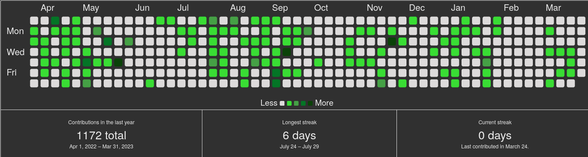

# hugo-github-calendar [](https://gohugo.io/)

[](https://github.com/future-wd/hugo-responsive-images/blob/master/LICENSE)
<!-- [](https://github.com/budparr/awesome-hugo) -->

## About

This is not a standalone theme. It is a [Hugo](https://gohugo.io) theme component providing a shortcode: `github-calendar` to display [github-calendar.js](https://bloggify.github.io/github-calendar/) in your Hugo site.



Contrary to other shortcodes, this shortcode uses locally sourced JS and CSS so they must be included.
Changes made from the [upstream source files](https://github.com/Bloggify/github-calendar/tree/gh-pages/dist) were:

- **github-calendar.min.js**: reducing the width of the graph inside its container for better looks (upstream the text is too close to the left border of its container)
- **github-calendar.css**: introducing root variables for background and text color to make them conveniently configurable via the shortcode

## Usage

1. Add the `hugo-github-calendar` as a submodule to be able to get upstream changes later `git submodule add https://github.com/totoroot/hugo-github-calendar.git themes/hugo-github-calendar`
2. Add `hugo-github-calendar` as the left-most element of the `theme` list variable in your site's or theme's configuration file `config.yaml` or `config.toml`. Example, with `config.yaml`:
    ```yaml
    theme: ["hugo-github-calendar", "my-theme"]
    ```
    or, with `config.toml`,
    ```toml
    theme = ["hugo-github-calendar", "my-theme"]
    ```
3. In your site, use the shortcode, this way:
    ```go
    

    ```
    Just replace my username with yours. The shortcode expects at least the username, but accepts some optional variable as well.

    All options that can be passed via shortcode, are listed below:
    ```go
    

    ```

    | Name | Type | Default | Description |
    | ---- | ---- | ---- | ---- |
    | username | string | totoroot | The username used to fetch GitHub contributions. |
    | responsive | bool | true | If graph should be sized responsively in relation to its container. |
    | width | integer | 100 | The width of the graph's <div> container in percent. |
    | backgroundColor | CSS color value | #303030 | The color value to use for the background of the container. |
    | textColor | CSS color value | #ececec | The color value to use for all text in the container. |

## License

[hugo-github-calendar](https://github.com/totoroot/hugo-github-calendar) by [Matthias Thym](https://github.com/totoroot), as well as [github-calendar.js](https://github.com/Bloggify/github-calendar) are licensed under [MIT](https://github.com/totoroot/hugo-github-calendar/blob/main/LICENSE) license.
